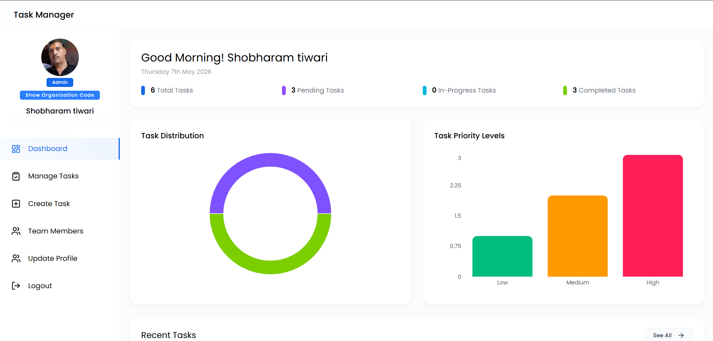
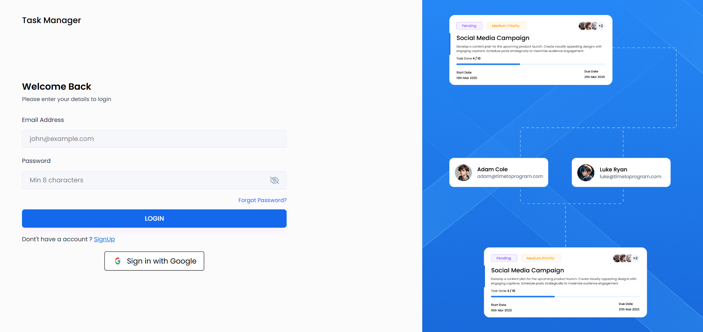
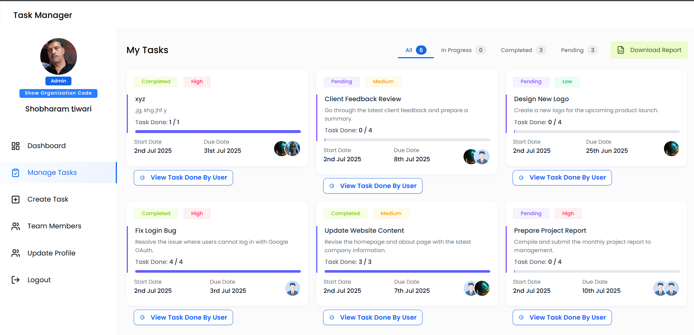
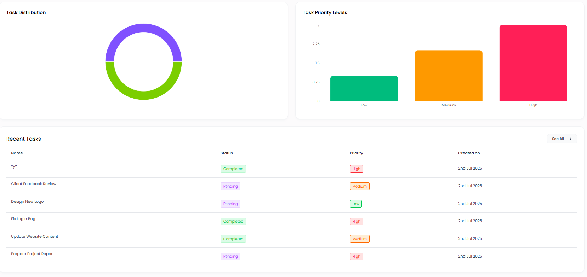

<div align="center">

# 🚀 Task Manager Pro
### Enterprise-Ready MERN Productivity Platform


### Build • Assign • Track • Analyze • Scale

A secure, scalable, and production-ready task management platform built for teams, organizations, and productivity-driven workflows.

</div>

---

# 🌐 Live Deployment

## Frontend
https://task-manager-frontend-three-bay.vercel.app/
## Backend API
https://task-manager-backend-99rj.onrender.com

---

# 📸 Product Showcase

## 🖥 Dashboard Preview

### Main Dashboard
Add your dashboard screenshot here:



---

### Authentication Page



---

### Task Management



---

### Analytics Dashboard



---

# 🎬 Product Walkthrough

## Full Application Demo

▶ Add your demo video link here:

[Watch Full Demo](YOUR_VIDEO_LINK)

---

## Feature Demonstrations

### 🔐 Authentication Flow

[Watch Authentication Demo](YOUR_AUTH_VIDEO_LINK)

### 📋 Task Workflow

[Watch Task Management Demo](YOUR_TASK_VIDEO_LINK)

### 📊 Analytics Demo

[Watch Analytics Demo](YOUR_ANALYTICS_VIDEO_LINK)

### 👥 Admin vs Member Workflow

[Watch Role-Based Access Demo](YOUR_ROLE_VIDEO_LINK)

---

# 📖 Project Overview

Task Manager Pro is a modern full-stack productivity ecosystem designed to solve real organizational workflow challenges.

Unlike traditional to-do applications, Task Manager Pro offers:

- Secure authentication workflows
- Role-based access control
- Organization-level onboarding
- Task assignment systems
- Performance analytics
- Production-ready deployment

Built using the MERN stack with a strong focus on:

### Security • Performance • Scalability • User Experience

---

# ✨ Core Features

# 🔐 Authentication & Security

### Supported Authentication Methods

✅ Email + Password Authentication  
✅ OTP-Based Email Verification  
✅ Google OAuth Login  
✅ JWT Authentication  
✅ Password Reset via OTP  

### Security Features

✅ bcrypt Password Hashing  
✅ JWT Session Management  
✅ Secure Route Protection  
✅ Role-Based Authorization  

---

# 👥 Role-Based Access Control

## 👑 Admin

Admins can:

✅ Create Tasks  
✅ Assign Tasks  
✅ Manage Members  
✅ Access Reports  
✅ View Team Analytics  
✅ Manage Organization Access  

---

## 👨‍💻 Members

Members can:

✅ View Assigned Tasks  
✅ Update Task Progress  
✅ Complete Tasks  
✅ Track Personal Productivity  

---

# 🏢 Organization Security

Enterprise onboarding system includes:

### Organization Verification

Users must enter:

✅ Secure 14-digit Organization Code

### Admin Verification

Admins must enter:

✅ Admin Invite Token

This prevents unauthorized access.

---

# 📋 Task Management System

### Task Features

✅ Create Tasks  
✅ Assign Tasks  
✅ Set Deadlines  
✅ Priority Management  
✅ Progress Tracking  
✅ Status Updates  
✅ Completion Workflow  

---

# 📊 Reports & Analytics

Admins can monitor:

✅ Team Productivity  
✅ Task Completion Trends  
✅ Performance Metrics  
✅ Workload Distribution  
✅ Project Progress  

---

# 👤 User Profile System

Users can:

✅ Upload Profile Picture  
✅ Update Profile Information  
✅ Change Password  
✅ Manage Account Settings  

---

# 📧 Email Infrastructure

Powered by Brevo transactional email system.

### Email Features

✅ Registration OTP  
✅ Password Reset OTP  
✅ Transactional Email Delivery  
✅ Production Deployment Compatible  

---

# ⚡ Performance Optimizations

Implemented optimizations:

✅ Image Compression Before Upload  
✅ Non-Blocking OTP Email Sending  
✅ Cloud Deployment Optimization  
✅ Reduced Signup Latency  
✅ API Performance Tuning  

---

# 🛠 Tech Stack

## Frontend

| Technology | Purpose |
|------------|---------|
| React.js | UI Development |
| Tailwind CSS | Styling |
| Axios | API Calls |
| React Router | Routing |
| Context API | State Management |
| React Hot Toast | Notifications |

---

## Backend

| Technology | Purpose |
|------------|---------|
| Node.js | Runtime |
| Express.js | API Server |
| MongoDB | Database |
| Mongoose | ODM |
| JWT | Authentication |
| Passport.js | Google OAuth |
| Brevo | Transactional Emails |
| Multer | File Upload |

---

## Deployment

| Platform | Purpose |
|----------|---------|
| Vercel | Frontend Hosting |
| Render | Backend Hosting |
| MongoDB Atlas | Cloud Database |

---

# 📂 Project Architecture

## Frontend Structure

```bash
src/
├── components/
├── context/
├── pages/
├── routes/
├── utils/
└── App.jsx
```

---

## Backend Structure

```bash
backend/
├── config/
├── controllers/
├── middleware/
├── models/
├── routes/
├── utils/
└── server.js
```

---

# 🔄 Authentication Flow

```txt
User Registration
      ↓
Profile Upload
      ↓
OTP Generation
      ↓
Email Verification
      ↓
JWT Authentication
      ↓
Role-Based Dashboard Access
```

---

# ⚙ Environment Variables

## Frontend (.env)

```env
VITE_API_URL=your_backend_url
```

---

## Backend (.env)

```env
PORT=5000

MONGO_URI=your_mongodb_connection

JWT_SECRET=your_jwt_secret

CLIENT_URL=your_frontend_url

EMAIL_USER=your_brevo_smtp_login
EMAIL_PASS=your_brevo_smtp_password
EMAIL_FROM=your_verified_sender_email

GOOGLE_CLIENT_ID=your_google_client_id
GOOGLE_CLIENT_SECRET=your_google_client_secret
GOOGLE_CALLBACK_URL=your_google_callback_url

ADMIN_INVITE_TOKEN=your_admin_token
ORG_CODE=your_organization_code
```

---

# 🚀 Installation Guide

## Clone Repository

```bash
git clone <repository_url>
```

---

## Backend Setup

```bash
cd backend
npm install
npm run dev
```

---

## Frontend Setup

```bash
cd frontend
npm install
npm run dev
```

---

# 🎯 Real-World Problems Solved

This project solves:

✅ Team productivity management  
✅ Secure onboarding workflows  
✅ Organization-level access control  
✅ Email verification systems  
✅ Task lifecycle tracking  
✅ Performance analytics  

---

# 📈 Future Enhancements

Planned upgrades:

🔔 Real-Time Notifications  
💬 Team Chat System  
📅 Calendar Integration  
📱 Mobile Application  
🤖 AI Productivity Insights  
📎 File Attachments  

---

# 🤝 Contributing

Contributions are always welcome.

### Steps:

1. Fork this repository  
2. Create a feature branch  
3. Commit your changes  
4. Open a Pull Request  

---

# 👨‍💻 Developer

## Shivashish Tiwari

Full Stack Developer passionate about building scalable and impactful products.

---

<div align="center">

### ⭐ If this project impressed you, consider starring the repository ⭐

Built with ❤️ using the MERN Stack

</div>
